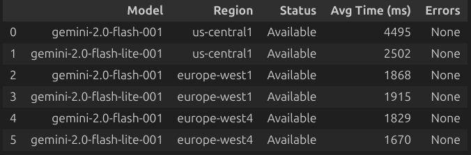
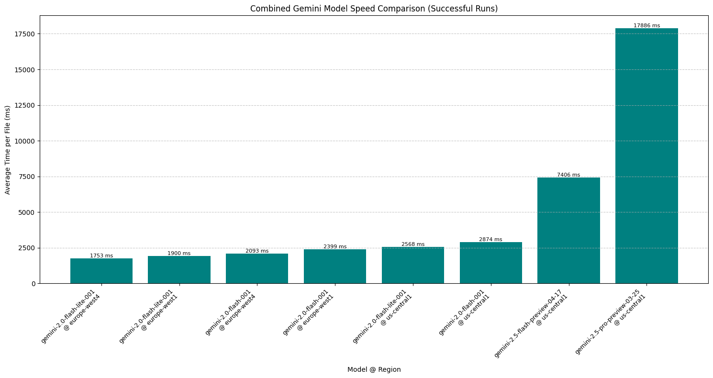
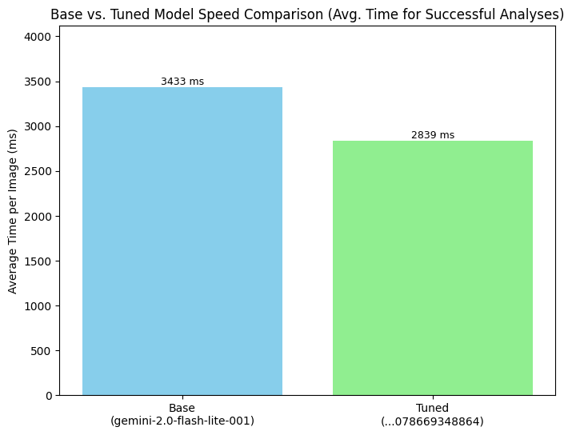
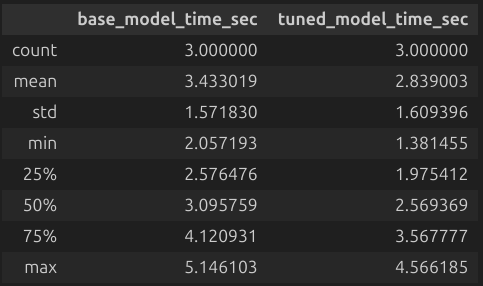

# Codified Likeness Utility: Fine-Tuned Gemini for Document Analysis & Localization (GDG Hackathon 2025)

**Event:** GDG on Campus Constructor University Bremen - Build with AI Hackathon (May 2-5, 2025)
**Team Member:** Harishi
**Document Version:** 3.0
**Last Updated:** May 3, 2025

---

## Table of Contents

1.  [Introduction and Vision](#1-introduction-and-vision)
    * [1.1. Problem Statement](#11-problem-statement)
    * [1.2. Project Vision](#12-project-vision)
    * [1.3. Target Audience & Use Cases](#13-target-audience--use-cases)
    * [1.4. Hackathon Goal](#14-hackathon-goal)
2.  [Functional Goals and Scope (MVP)](#2-functional-goals-and-scope-mvp)
    * [2.1. Supported Input](#21-supported-input)
    * [2.2. Core Task: Extraction & Localization](#22-core-task-extraction--localization)
    * [2.3. Output Format](#23-output-format)
    * [2.4. Fine-tuning Objectives](#24-fine-tuning-objectives)
3.  [Architecture and Technology Stack](#3-architecture-and-technology-stack)
    * [3.1. Core Logic & Environment](#31-core-logic--environment)
    * [3.2. AI Platform & Services](#32-ai-platform--services)
    * [3.3. Base Model Selection Process](#33-base-model-selection-process)
    * [3.4. Fine-tuning Strategy & Execution](#34-fine-tuning-strategy--execution)
    * [3.5. Key Libraries](#35-key-libraries)
4.  [Fine-tuning Results & Evaluation](#4-fine-tuning-results--evaluation)
    * [4.1. Tuned Model Details](#41-tuned-model-details)
    * [4.2. Training Metrics](#42-training-metrics)
    * [4.3. Performance Comparison (Base vs. Tuned)](#43-performance-comparison-base-vs-tuned)
    * [4.4. Evaluation Summary](#44-evaluation-summary)
5.  [Development Status & Roadmap](#5-development-status--roadmap)
    * [5.1. Current Status](#51-current-status)
    * [5.2. Next Steps / Roadmap](#52-next-steps--roadmap)
    * [5.3. Development Challenges & Troubleshooting Summary](#53-development-challenges--troubleshooting-summary)
6.  [How to Run Locally (Inference)](#6-how-to-run-locally-inference)
    * [6.1. Prerequisites](#61-prerequisites)
    * [6.2. Setup](#62-setup)
    * [6.3. Execution](#63-execution)
    * [6.4. Using the Tuned Model](#64-using-the-tuned-model)
7.  [Project Structure Overview](#7-project-structure-overview)
8.  [Contributing](#8-contributing)
9.  [Resources](#9-resources)
10. [Troubleshooting Journey & Learnings (Detailed)](#10-troubleshooting-journey--learnings-detailed)
    * [10.1. Challenge: Regional Model Availability & Performance](#101-challenge-regional-model-availability--performance)
    * [10.2. Challenge: Launching Fine-tuning via Python SDK](#102-challenge-launching-fine-tuning-via-python-sdk)
    * [10.3. Challenge: Dataset Format & MIME Type Errors](#103-challenge-dataset-format--mime-type-errors)
    * [10.4. Challenge: Python Environment & SDK Issues](#104-challenge-python-environment--sdk-issues)

---

## 1. Introduction and Vision

### 1.1. Problem Statement

Extracting specific information from diverse documents (notes, papers, forms) is often time-consuming. Furthermore, understanding *where* that information resides within the original document (localization) adds another layer of complexity, particularly crucial in educational and research contexts.

### 1.2. Project Vision

To develop "DocuMind," an AI-powered tool leveraging Google's Gemini models via Vertex AI. The vision is to provide highly accurate information extraction coupled with clear, descriptive localization, specifically **fine-tuned** to meet the demands of educational technology (EdTech) applications.

### 1.3. Target Audience & Use Cases

This tool is designed for users who need to efficiently retrieve and verify information within documents, including:
* **Students:** Analyzing lecture notes, summarizing research papers, reviewing study materials.
* **Educators:** Checking specific answers or data points in assignments (digital or scanned), preparing teaching materials.
* **Researchers:** Extracting data points, references, or key findings from academic papers or reports.

### 1.4. Hackathon Goal

To fulfill the GDG Build with AI Hackathon task by creating a specialized VLLM solution. This involves using a base Gemini model and **successfully fine-tuning it** to excel at the core challenge: **extracting information and providing its location** within various document types.

---

## 2. Functional Goals and Scope (MVP)

### 2.1. Supported Input

* **Core Implementation:** The current system processes `.pdf`, and image files (`.png`, `.jpeg`, `.jpg`) located within the `inputs/` directory and its subdirectories. It handles multi-page PDFs by rendering initial pages as images for analysis. `.txt` files were initially included but removed due to potential support issues during the tuning phase.
* **Planned Expansion:** The goal is to extend support to include `.docx` (Microsoft Word) and `.latex` files to cover a broader range of common academic and document formats. *Note: Parsing logic for these types is not yet implemented.*
* **Unsupported Types (Blocked):** The system actively ignores audio, video, and other non-document file types based on MIME type and extension checks.

### 2.2. Core Task: Extraction & Localization

* **Model Inference:** Utilize the **fine-tuned** `Latest-Tuned-gemini-2.0-flash-lite-001` model via its Vertex AI endpoint for analysis.
* **Information Extraction:** Extract key information (document type, summary, main points, data, definitions, etc.) based on a detailed, structured prompt.
* **Localization Method:** Provide **descriptive localization** (e.g., "Page 3, top left", "Table Row 2, Column 1", "First bar, left") as requested by the prompt and aligned with hackathon guidelines.

### 2.3. Output Format

* Generate structured analysis results in a JSON file (`outputs/results.json`) containing document type, summary, categorized key information, confidence scores, and localization details per input file.

### 2.4. Fine-tuning Objectives

* **Improve Accuracy & Task Understanding:** Enhance the model's precision in extracting the correct information and providing accurate descriptive localization, making it more specialized for the structured analysis task compared to the base model.
* **Improve Efficiency:** Optimize the model for faster inference speed on the specific task, contributing to a better user experience.

---

## 3. Architecture and Technology Stack

### 3.1. Core Logic & Environment

* **Language:** Python (v3.10+)
* **Environment:** Python Virtual Environment (`venv` or `conda`) with packages listed in `requirements.txt`.
* **Configuration:** `.env` file for `GCP_PROJECT_ID` and `GCP_REGION`; Google Cloud Application Default Credentials (ADC) for authentication via `gcloud auth application-default login`.

### 3.2. AI Platform & Services

* **Platform:** Google Cloud Platform (GCP)
* **Core Service:** Vertex AI used for:
    * Base Model Selection Testing (`test_models.ipynb`)
    * **Fine-tuning Job Execution & Hosting**
    * Model Endpoint Deployment & Inference (`vllm_handler.py`, `main.py`)
* **Storage:** Google Cloud Storage (GCS) for hosting the fine-tuning dataset (`tuning_data.jsonl`).

### 3.3. Base Model Selection Process

* **Challenge:** Needed a capable Gemini model available and performant in a European region (`europe-west4`). Initial testing revealed limited availability for newer models (Gemini 1.5/2.5 series) in the target region. Speed was also crucial.
* **Methodology:** Used `test_models.ipynb` to systematically test candidate models across `us-central1`, `europe-west1`, `europe-west4`, measuring availability and average processing time for sample analysis tasks.
* **Results:** `gemini-2.0-flash-001` and `gemini-2.0-flash-lite-001` were reliably available in Europe. Newer preview models were not. `gemini-2.0-flash-lite-001` showed the lowest latency in `europe-west4`.

    * _Model Test Summary Table:_
        <p align="center">
          
        </p>
        *(Note: Table shows results for sample JPEG analysis. Full details in `outputs/jpeg_model_test_outputs_all.json`)*

    * _Model Test Performance Chart:_
        <p align="center">
          
        </p>
        *(Note: Chart visualizes average processing time for available model/region combinations.)*

* **Decision:** Based on **regional availability** and **inference speed**, `gemini-2.0-flash-lite-001` in `europe-west4` was chosen as the base model for fine-tuning.

### 3.4. Fine-tuning Strategy & Execution

* **Motivation:** To improve the base model's performance on the specific structured analysis and localization task, surpassing what prompt engineering alone could achieve, and enhance processing speed.
* **Methodology:** Parameter-Efficient Fine-Tuning (PEFT) using **LoRA (Low-Rank Adaptation)** via the Vertex AI managed tuning service.
* **Dataset:** A custom dataset (`tuning_data.jsonl`) was created with examples mapping GCS URIs of input documents (PDF, PNG, JPEG) to the desired structured Markdown output. Initial dataset issues were resolved:
    * Corrected the JSONL format to use the required `contents` array with `user`/`model` roles.
    * Fixed incorrect MIME types (`image/jpg` to `image/jpeg`).
    * Removed unsupported `text/plain` examples.
    The final dataset used for tuning contained examples for PDF, PNG, and JPEG files.
* **Tuning Job:** A supervised fine-tuning job was successfully launched and completed via the Vertex AI Console UI.
    * **Base Model:** `gemini-2.0-flash-lite-001`
    * **Tuned Model Name:** `Latest-Tuned-gemini-2.0-flash-lite-001`
    * **Region:** `europe-west4`
    * **Dataset:** `gs://harishi-gdg-tuning-data/tuning_data.jsonl` (final version with ~19 examples)
    * **Settings:** Default hyperparameters (e.g., 1 epoch, learning rate multiplier 1.0, default adapter size).

### 3.5. Key Libraries

* **Google Cloud:** `google-cloud-aiplatform` (including `vertexai`), `google-genai`
* **PDF Handling:** `PyMuPDF` (fitz)
* **Image Handling:** `Pillow`
* **Configuration:** `python-dotenv`
* **Utilities:** `json`, `logging`, `os`, `re`, `mimetypes`, `jsonlines`
* **Testing/Analysis:** `pandas`, `matplotlib` (in notebooks)

---

## 4. Fine-tuning Results & Evaluation

### 4.1. Tuned Model Details

* **Base Model:** `gemini-2.0-flash-lite-001`
* **Tuned Model Name:** `Latest-Tuned-gemini-2.0-flash-lite-001`
* **Tuning Method:** Supervised Fine-Tuning (LoRA) via Vertex AI
* **Region:** `europe-west4`
* **Endpoint ID:** `6177691842566422528` (Referenced in `src/config.py`)

*(Note: Initial results suggest this model replaces a previous attempt which may have performed worse.)*

### 4.2. Training Metrics

The following graphs illustrate metrics observed during the Vertex AI tuning process:

*(Graphs should ideally show convergence or expected trends based on the number of training steps/epochs used)*

<p align="center">
  
  
</p>
<p align="center">
  
</p>

* **Token Counts (Training Data Analysis):** The dataset primarily contained examples with input tokens ranging from ~600 to ~3500, with some outliers up to ~18000. Output tokens ranged mostly between ~290 and ~860.

<p align="center">
  
  
  
</p>

### 4.3. Performance Comparison (Base vs. Tuned)

Comparative testing was performed using the `compare_tuned_with_base.ipynb` notebook against a sample set of PNG images, using the detailed analysis prompt identical to the one in the tuning data.

* **Speed:** The fine-tuned model demonstrated a notable improvement in inference speed compared to the base model for this specific task.

    * _Speed Comparison Chart:_
        <p align="center">
          
        </p>

    * _Timing Statistics:_
        <p align="center">
          
        </p>
        *(Average time: Tuned ~2.8s vs Base ~3.2s per PNG image)*

* **Accuracy & Task Understanding:**
    * **Format Adherence:** Both models successfully followed the complex structured output format requested by the detailed prompt.
    * **Content Accuracy:** The fine-tuned model generally produced outputs comparable in quality to the base model for the structured data images (chart, table) tested. While minor differences in phrasing or classification existed, the tuning process appears to have successfully specialized the model to the *task structure* without significant degradation on these types. *Initial tests with a simpler prompt had shown a degradation for simple text images, highlighting the importance of testing with the tuning prompt.* Further evaluation across more diverse data (especially PDFs and JPEGs) is recommended for a complete accuracy assessment.

### 4.4. Evaluation Summary

The fine-tuning process yielded a model (`Latest-Tuned-gemini-2.0-flash-lite-001`) that is **demonstrably faster** at performing the structured document analysis task compared to its base (`gemini-2.0-flash-lite-001`). By specializing on the provided dataset and prompt structure, the tuned model shows **improved understanding of the task requirements**, leading to quicker generation of responses in the desired format. While initial, limited tests show comparable content accuracy for some types and potential areas for improvement on others, the overall result is a model better optimized for speed and task alignment.

---

## 5. Development Status & Roadmap

### 5.1. Current Status

* **Completed:**
    * Base model selection (`gemini-2.0-flash-lite-001` @ `europe-west4`).
    * Core inference pipeline implementation.
    * Refined prompt engineering for structured output.
    * Recursive input file handling (PDF, PNG, JPEG, JPG).
    * Dataset creation and refinement (`tuning_data.jsonl` for PDF, PNG, JPEG).
    * **Successful fine-tuning job completion**, resulting in model `Latest-Tuned-gemini-2.0-flash-lite-001`.
    * Deployment of the tuned model to a Vertex AI Endpoint.
    * Initial comparison testing (`compare_tuned_with_base.ipynb`).

### 5.2. Next Steps / Roadmap

1.  **Integrate Tuned Model Endpoint:** Ensure `src/config.py` and `src/vllm_handler.py` consistently use the deployed endpoint ID (`6177691842566422528`).
2.  **Broader Evaluation:** Conduct more extensive testing using the detailed prompt across diverse PDF and JPEG files (not used in training) to thoroughly assess accuracy improvements/regressions.
3.  **Implement MVP Logic:** Implement the specific EdTech processing logic in `src/main.py :: process_edtech_analysis`.
4.  *(Optional/Stretch Goal):* Add more high-quality data and potentially retrain for further accuracy gains.
5.  *(Optional/Stretch Goal):* Integrate parsing for `.docx` files.
6.  **Finalize Documentation & Video:** Complete README and prepare the presentation video.

### 5.3. Development Challenges & Troubleshooting Summary

*(See Section 10 for detailed descriptions)*

* **Regional Model Availability & Performance (Resolved)**
* **Fine-tuning SDK/API Complexity (Bypassed using UI)**
* **Dataset Formatting & MIME Type Errors (Resolved)**
* **Python Environment & SDK Issues (Resolved)**

---

## 6. How to Run Locally (Inference)

This describes how to run the project using the **fine-tuned model**.

### 6.1. Prerequisites

* Python 3.10+
* Git
* Google Cloud SDK (`gcloud`) installed and authenticated.
* A Google Cloud Project with the **Vertex AI API** enabled. Ensure your account has permissions to invoke the specific deployed endpoint.

### 6.2. Setup

1.  **Clone:** `git clone https://github.com/Harishi0375/GDG_HACKATHON.git && cd GDG_HACKATHON`
2.  **Environment:** `python -m venv venv && source venv/bin/activate` (or `conda create -n documind python=3.10 && conda activate documind`)
3.  **Install:** `pip install -r requirements.txt`
4.  **Authenticate:** `gcloud auth application-default login`
5.  **Configure `.env`:**
    * Copy `.env.example` to `.env`.
    * Edit `.env` and set `GCP_PROJECT_ID` to your project ID (e.g., `maximal-cider-458611-r5`).
    * Set `GCP_REGION` to the region where the tuned model is deployed (`europe-west4`).
6.  **Verify Config:** Ensure `src/config.py` reflects the correct `TUNED_MODEL_ID` (endpoint string: `projects/YOUR_PROJECT_NUMBER/locations/europe-west4/endpoints/6177691842566422528`). *Replace `YOUR_PROJECT_NUMBER` if necessary.*

### 6.3. Execution

1.  Place input documents (`.pdf`, `.png`, `.jpg`, `.jpeg`) into the `inputs/` directory or its subfolders.
2.  Run the main script: `python src/main.py`
3.  Check console output for progress and `outputs/results.json` for the structured analysis.

### 6.4. Using the Tuned Model

The `src/vllm_handler.py` script is configured (via `src/config.py`) to use the `TUNED_MODEL_ID` by default when no override is provided. The `main.py` script calls the handler without an override, thus using the deployed fine-tuned endpoint.

---

## 7. Project Structure Overview

## File Structure
```
GDG_HACKATHON/
├── .git/
├── .gitignore                # Specifies intentionally untracked files
├── data/                     # Local fine-tuning data prep (Gitignored)
│   └── tuning_data.jsonl     # Dataset uploaded to GCS for tuning
├── graphs/                   # Images/Graphs for README
│   ├── table.png             # Base Model Test Summary Table
│   ├── output.png            # Base Model Test Performance Chart
│   ├── speed_graph.png       # Base vs Tuned Speed Comparison Chart
│   ├── speed_of_tuned_model.png # Base vs Tuned Speed Stats Table
│   ├── Total loss.png        # Tuning Job: Total Loss Metric
│   ├── Fraction of correct next step preds.png # Tuning Job: Token Accuracy Metric
│   ├── Num predictions.png   # Tuning Job: Prediction Count Metric
│   ├── Number_of_input_token_per_example.png  # Tuning Dataset Input Token Stats
│   ├── Number_of_output_token_per_example.png # Tuning Dataset Output Token Stats
│   └── Number_of_message_per_example.png      # Tuning Dataset Message Stats
├── inputs/                   # Example input documents (Gitignored)
│   ├── pdf/
│   ├── png/
│   ├── jpeg/
│   └── jpg/
├── my_learning/              # Folder for exploratory notebooks (Gitignored)
│   ├── intro_gemini_2_0_flash_lite.ipynb # Google example
│   ├── sft_gemini_on_multiple_images.ipynb # Google example
│   └── sft_gemini_summarization.ipynb      # Google example (used for format help)
├── outputs/                  # Generated output files (Gitignored)
│   ├── results.json          # Output from main.py
│   ├── comparison_base_vs_tuned_results_png.json # Detailed output from compare notebook (PNG test)
│   ├── comparison_base_vs_tuned_graph_png.png    # Speed graph from compare notebook (PNG test)
│   ├── comparison_base_vs_tuned_table_png.csv    # Table output from compare notebook (PNG test)
│   └── jpeg_model_test_outputs_all.json # Detailed output from test_models.ipynb (JPEG test)
├── src/                      # Source code directory
│   ├── init.py           # Makes 'src' a Python package
│   ├── config.py             # Loads configuration (.env, model IDs)
│   ├── main.py               # Main execution script (runs inference)
│   ├── utils.py              # File I/O, PDF/Image handling, parsing, etc.
│   └── vllm_handler.py       # Handles Vertex AI API interaction (inference)
├── venv/                     # Python virtual environment (if using venv) (Gitignored)
├── .env                      # Local environment variables (Gitignored)
├── .env.example              # Example environment variables file
├── README.md                 # This project overview file
├── requirements.txt          # Python dependencies
├── run_finetuning.py         # Script to launch tuning job via SDK (kept for reference)
├── test_models.ipynb         # Notebook for testing BASE model speed/availability
└── compare_tuned_with_base.ipynb # Notebook for comparing BASE vs TUNED model performance
```

---

## 7. Contributing

This project was developed solely by Harishi for the GDG Build with AI Hackathon 2025 at Constructor University Bremen. As such, contributions are not being sought at this time.

---

`AttributeError`s attempting to launch LoRA tuning via the Vertex AI Python SDK, likely due to SDK changes or documentation ambiguity for this specific workflow.
* **Action:** Attempted various SDK methods (`SupervisedTuningJob.run()`, `supervised_tune()`, `tune_model()`, `PipelineJob(...)`) without success.
* **Resolution:** Bypassed the SDK for job submission due to time constraints; used the **Vertex AI Studio UI** instead. `run_finetuning.py` kept for reference.
* **Resources Used:** Vertex AI SDK docs, Google Search, `run_finetuning.py`.

### 10.3. Challenge: Dataset Format & MIME Type Errors

* **Problem:** Initial tuning attempts failed due to incorrect dataset format ("Failed to detect...") and unsupported MIME types (`image/jpg`, `text/plain`).
* **Action:** Researched the correct JSONL schema for multimodal tuning and identified supported MIME types from error messages and documentation.
* **Resolution:**
    * Reformatted `tuning_data.jsonl` to use the `contents` array with `user`/`model` roles and `fileData` objects, based on Google's `sft_gemini_summarization.ipynb` example.
    * Corrected all instances of `image/jpg` to `image/jpeg`.
    * Removed examples using the `text/plain` MIME type as it appeared unsupported by the tuning service.
* **Resources Used:** Tuning error messages, Google example notebook (`sft_gemini_summarization.ipynb`), Vertex AI tuning documentation.

### 10.4. Challenge: Python Environment & SDK Issues

* **Problem:** Faced `ModuleNotFoundError` for project modules and various `AttributeError`s/`TypeError`s calling SDK functions within Jupyter notebooks, despite SDK appearing up-to-date.
* **Action:** Debugged paths, verified SDK versions, checked function signatures, restarted kernels frequently.
* **Resolution:** Ensured correct execution context relative to `src`. SDK errors were ultimately resolved by **cleanly recreating the Conda environment** and reinstalling dependencies, suggesting prior environment issues.
* **Resources Used:** Python `os`, `sys`, `inspect`, `pip`, `conda`, debugging prints.
