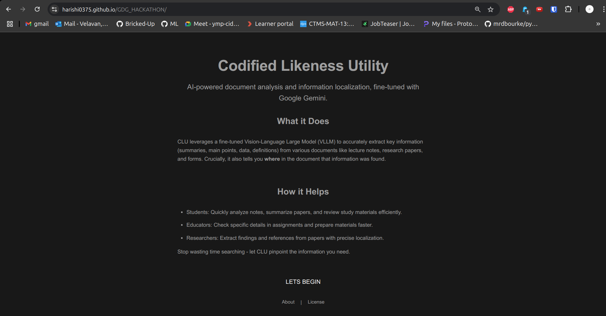
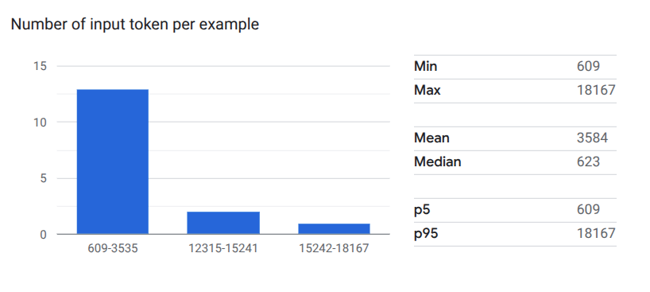
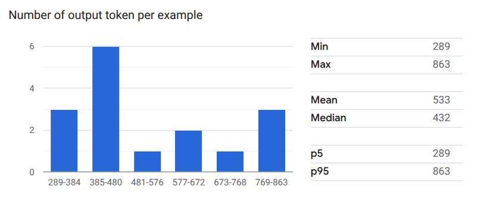
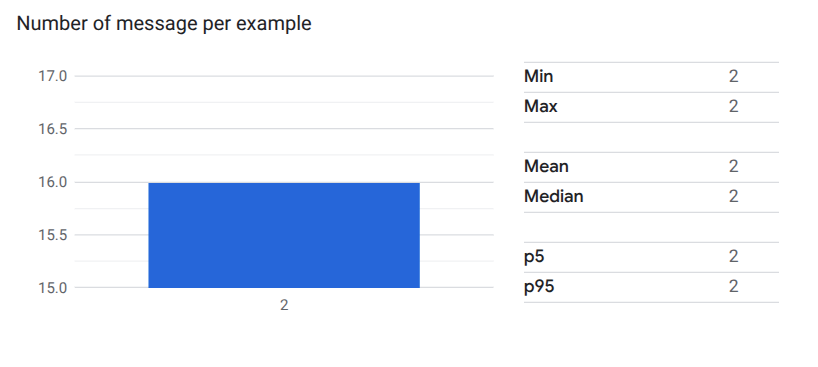

# Codified Likeness Utility: Fine-Tuned Gemini for Document Analysis & Localization (GDG Hackathon 2025)

**Event:** GDG on Campus Constructor University Bremen - Build with AI Hackathon (May 2-5, 2025)
**Team Member:** Harishi
**Document Version:** 4.0
**Last Updated:** May 4, 2025

---

## Table of Contents

1.  [Introduction and Vision](#1-introduction-and-vision)
    * [1.1. Problem Statement](#11-problem-statement)
    * [1.2. Project Vision](#12-project-vision)
    * [1.3. Target Audience & Use Cases](#13-target-audience--use-cases)
    * [1.4. Hackathon Goal](#14-hackathon-goal)
2.  [Functional Goals and Scope (MVP)](#2-functional-goals-and-scope-mvp)
    * [2.1. Supported Input](#21-supported-input)
    * [2.2. Core Task: Extraction & Localization](#22-core-task-extraction--localization)
    * [2.3. Output Format](#23-output-format)
    * [2.4. Fine-tuning Objectives](#24-fine-tuning-objectives)
3.  [Architecture and Technology Stack](#3-architecture-and-technology-stack)
    * [3.1. Overview](#31-overview)
    * [3.2. Frontend Application](#32-frontend-application)
    * [3.3. Backend API](#33-backend-api)
    * [3.4. AI Platform & Services](#34-ai-platform--services)
    * [3.5. Base Model Selection Process](#35-base-model-selection-process)
    * [3.6. Fine-tuning Strategy & Execution](#36-fine-tuning-strategy--execution)
    * [3.7. Key Libraries & Frameworks](#37-key-libraries--frameworks)
4.  [Fine-tuning Results & Evaluation](#4-fine-tuning-results--evaluation)
    * [4.1. Tuned Model Details](#41-tuned-model-details)
    * [4.2. Training Metrics](#42-training-metrics)
    * [4.3. Performance Comparison (Base vs. Tuned)](#43-performance-comparison-base-vs-tuned)
    * [4.4. Evaluation Summary](#44-evaluation-summary)
5.  [Deployment](#5-deployment)
    * [5.1. Frontend Deployment (GitHub Pages)](#51-frontend-deployment-github-pages)
    * [5.2. Backend Deployment (Google Cloud Run)](#52-backend-deployment-google-cloud-run)
    * [5.3. Live Application URL](#53-live-application-url)
6.  [How to Use the Application](#6-how-to-use-the-application)
    * [6.1. Accessing the Tool](#61-accessing-the-tool)
    * [6.2. Uploading Documents](#62-uploading-documents)
    * [6.3. Submitting a Prompt](#63-submitting-a-prompt)
    * [6.4. Viewing Results](#64-viewing-results)
7.  [Development Status & Roadmap](#7-development-status--roadmap)
    * [7.1. Current Status](#71-current-status)
    * [7.2. Next Steps / Roadmap](#72-next-steps--roadmap)
    * [7.3. Development Challenges & Troubleshooting Summary](#73-development-challenges--troubleshooting-summary)
8.  [How to Run Locally (Inference)](#8-how-to-run-locally-inference)
    * [8.1. Prerequisites](#81-prerequisites)
    * [8.2. Setup](#82-setup)
    * [8.3. Execution](#83-execution)
    * [8.4. Using the Tuned Model](#84-using-the-tuned-model)
9.  [Project Structure Overview](#9-project-structure-overview)
10. [Contributing](#10-contributing)
11. [Resources](#11-resources)
12. [Troubleshooting Journey & Learnings (Detailed)](#12-troubleshooting-journey--learnings-detailed)
    * [12.1. Challenge: Regional Model Availability & Performance](#121-challenge-regional-model-availability--performance)
    * [12.2. Challenge: Launching Fine-tuning via Python SDK](#122-challenge-launching-fine-tuning-via-python-sdk)
    * [12.3. Challenge: Dataset Format & MIME Type Errors](#123-challenge-dataset-format--mime-type-errors)
    * [12.4. Challenge: Python Environment & SDK Issues](#124-challenge-python-environment--sdk-issues)
    * [12.5. Challenge: Frontend Deployment to GitHub Pages](#125-challenge-frontend-deployment-to-github-pages)
    * [12.6. Challenge: Backend Deployment & Runtime Issues](#126-challenge-backend-deployment--runtime-issues)

---

## 1. Introduction and Vision

### 1.1. Problem Statement

Extracting specific information from diverse documents (notes, papers, forms) is often time-consuming. Furthermore, understanding *where* that information resides within the original document (localization) adds another layer of complexity, particularly crucial in educational and research contexts.

### 1.2. Project Vision

To develop "Codified Likeness Utility (CLU)," an AI-powered tool leveraging Google's Gemini models via Vertex AI. The vision is to provide highly accurate information extraction coupled with clear, descriptive localization, specifically **fine-tuned** to meet the demands of educational technology (EdTech) applications.

### 1.3. Target Audience & Use Cases

This tool is designed for users who need to efficiently retrieve and verify information within documents, including:
* **Students:** Analyzing lecture notes, summarizing research papers, reviewing study materials.
* **Educators:** Checking specific answers or data points in assignments (digital or scanned), preparing teaching materials.
* **Researchers:** Extracting data points, references, or key findings from academic papers or reports.

### 1.4. Hackathon Goal

To fulfill the GDG Build with AI Hackathon task by creating a specialized VLLM solution. This involved using a base Gemini model, **successfully fine-tuning it** to excel at the core challenge (extracting information and providing its location), building a functional web interface, and deploying the full-stack application.

---

## 2. Functional Goals and Scope (MVP)

### 2.1. Supported Input

* **Core Implementation:** The application accepts `.pdf`, `.png`, `.jpeg`, and `.jpg` files uploaded via the web interface.
* **Planned Expansion:** The goal is to extend support to include `.docx` (Microsoft Word) and potentially `.latex` files.
* **Unsupported Types:** Other file types are currently not supported.

### 2.2. Core Task: Extraction & Localization

* **Model Inference:** Utilize the **fine-tuned** `Latest-Tuned-gemini-2.0-flash-lite-001` model via its Vertex AI endpoint for analysis.
* **Information Extraction:** Extract key information (document type, summary, main points, data, definitions, etc.) based on the user's prompt applied to the uploaded document(s).
* **Localization Method:** Provide **descriptive localization** (e.g., "Page 3, top left", "Table Row 2, Column 1", "First bar, left") as requested by the prompt and aligned with hackathon guidelines.

### 2.3. Output Format

* The backend API returns a JSON response containing the analysis text.
* The frontend displays the raw analysis text received from the backend in a designated results area. The analysis text itself follows the structured Markdown format defined in the backend prompt (Document Type, Summary, Key Information & Localization, Category).

### 2.4. Fine-tuning Objectives

* **Improve Accuracy & Task Understanding:** Enhance the model's precision in extracting the correct information and providing accurate descriptive localization, making it more specialized for the structured analysis task compared to the base model.
* **Improve Efficiency:** Optimize the model for faster inference speed on the specific task, contributing to a better user experience.

---

## 3. Architecture and Technology Stack

### 3.1. Overview

The project consists of a web-based frontend for user interaction and a Python backend API that handles file processing and AI analysis.

<p align="center">
  
  </p>

### 3.2. Frontend Application

* **Framework:** Vue.js (v3) with Vite for building.
* **Language:** JavaScript
* **Routing:** `vue-router` for handling navigation between pages (Landing, Prompt, About, License).
* **Styling:** Primarily CSS (scoped styles within components), utilizing CSS variables for theming.
* **Functionality:** Provides user interface for file upload (including drag-and-drop), text prompt input, displaying analysis results or error messages, and basic navigation.
* **Deployment:** Hosted as a static site on **GitHub Pages**.

### 3.3. Backend API

* **Framework:** Flask (Python Web Framework)
* **Language:** Python (v3.10+)
* **Functionality:**
    * Provides a RESTful API endpoint (`/api/analyze`).
    * Receives uploaded files (PDF, PNG, JPG/JPEG) and a text prompt.
    * Uses `tempfile` for secure handling of uploaded files.
    * Calls the `vllm_handler` module to perform analysis using Vertex AI.
    * Handles CORS (Cross-Origin Resource Sharing) to allow requests from the GitHub Pages frontend.
* **WSGI Server:** Gunicorn (used for production deployment in Cloud Run).
* **Deployment:** Containerized using **Docker** and deployed to **Google Cloud Run**.

### 3.4. AI Platform & Services

* **Platform:** Google Cloud Platform (GCP)
* **Core Service:** Vertex AI used for:
    * Base Model Selection Testing (`test_models.ipynb`)
    * **Fine-tuning Job Execution & Hosting**
    * Model Endpoint Deployment & Inference (`vllm_handler.py`, `main.py`)
* **Storage:** Google Cloud Storage (GCS) for hosting the fine-tuning dataset (`tuning_data.jsonl`).
* **Container Registry:** Google Artifact Registry for storing the backend Docker image.
* **Build Service:** Google Cloud Build for building the Docker image.

### 3.5. Base Model Selection Process

* **Challenge:** Needed a capable Gemini model available and performant in a European region (`europe-west4`).
* **Methodology:** Used `test_models.ipynb` to test candidate models (`gemini-2.0-flash-001`, `gemini-2.0-flash-lite-001`) across regions.
* **Decision:** Based on **regional availability** and **inference speed**, `gemini-2.0-flash-lite-001` in `europe-west4` was chosen as the base model for fine-tuning.
    * _See graphs in Section 4.2 of the original README for performance details._

### 3.6. Fine-tuning Strategy & Execution

* **Motivation:** To improve the base model's performance on the specific structured analysis and localization task.
* **Methodology:** Supervised Fine-Tuning (LoRA) via the Vertex AI managed tuning service.
* **Dataset:** Custom dataset (`tuning_data.jsonl`) with examples mapping GCS URIs (PDF, PNG, JPEG) to the desired structured Markdown output.
* **Tuning Job:** Launched via the Vertex AI Console UI.
    * **Base Model:** `gemini-2.0-flash-lite-001`
    * **Tuned Model Name:** `Latest-Tuned-gemini-2.0-flash-lite-001`
    * **Region:** `europe-west4`
    * **Dataset:** `gs://harishi-gdg-tuning-data/tuning_data.jsonl`

### 3.7. Key Libraries & Frameworks

* **Frontend:** Vue.js, Vite, vue-router
* **Backend:** Flask, Flask-CORS, Gunicorn, Pillow, PyMuPDF (fitz), python-dotenv
* **Google Cloud:** `google-cloud-aiplatform` (including `vertexai`), `google-cloud-storage`
* **Testing/Analysis:** pandas, matplotlib (in notebooks)

---

## 4. Fine-tuning Results & Evaluation

### 4.1. Tuned Model Details

* **Base Model:** `gemini-2.0-flash-lite-001`
* **Tuned Model Name:** `Latest-Tuned-gemini-2.0-flash-lite-001`
* **Tuning Method:** Supervised Fine-Tuning (LoRA) via Vertex AI
* **Region:** `europe-west4`
* **Endpoint ID:** `6177691842566422528` (Referenced in `src/config.py`)

### 4.2. Training Metrics

*(Graphs illustrate metrics observed during the Vertex AI tuning process)*

<p align="center">
  
  
</p>
<p align="center">
  
</p>
<p align="center">
  
  
  
</p>

### 4.3. Performance Comparison (Base vs. Tuned)

Comparative testing using `compare_tuned_with_base.ipynb` showed:

* **Speed:** The fine-tuned model demonstrated a notable improvement in inference speed (~2.8s vs ~3.2s average per PNG image).
* **Accuracy & Task Understanding:** Both models adhered to the requested output format. The tuned model's content accuracy was comparable for structured data images, demonstrating successful specialization to the task structure.

    * _See graphs in Section 4.3 of the original README for performance details._

### 4.4. Evaluation Summary

Fine-tuning yielded a model (`Latest-Tuned-gemini-2.0-flash-lite-001`) that is **faster** at the structured analysis task. It shows **improved understanding of the task requirements**, leading to quicker generation of responses in the desired format.

---

## 5. Deployment

### 5.1. Frontend Deployment (GitHub Pages)

* **Method:** Static site hosting via GitHub Pages.
* **Source:** GitHub Actions workflow (`.github/workflows/deploy.yml`).
* **Process:**
    1.  On push to the `master` branch, the workflow checks out the code.
    2.  It navigates into the `frontend/` directory.
    3.  Sets up Node.js using `actions/setup-node`.
    4.  Installs dependencies using `npm ci`.
    5.  Builds the Vue.js application using `npm run build` (outputting to `frontend/dist/`). The `vite.config.js` is configured with `base: '/GDG_HACKATHON/'`.
    6.  Uploads the `frontend/dist/` directory contents as a Pages artifact using `actions/upload-pages-artifact`.
    7.  A separate deploy job uses `actions/deploy-pages` to deploy the artifact to the GitHub Pages environment.
* **Configuration:** Repository Settings -> Pages -> Source set to "GitHub Actions".

### 5.2. Backend Deployment (Google Cloud Run)

* **Method:** Containerized deployment using Docker and Google Cloud Run.
* **Process:**
    1.  A `Dockerfile` defines the container environment (Python 3.12, dependencies from `requirements.txt`, copies `src/` code).
    2.  The `CMD` instruction uses `gunicorn` with 4 workers and an increased timeout (`--timeout 120`) to run the Flask app (`src.api:app`) on port 8080.
    3.  The image is built using Google Cloud Build (`gcloud builds submit`) and pushed to Google Artifact Registry.
    4.  The image is deployed to Cloud Run (`gcloud run deploy`) as a managed service (`clu-backend-service`) in the `europe-west4` region.
    5.  Configuration includes:
        * Memory increased to 1GiB (`--memory=1Gi`) to prevent crashes.
        * Environment variables (`GCP_PROJECT_ID`, `GCP_REGION`) set via `--set-env-vars`.
        * Public access enabled (`--allow-unauthenticated`).
        * Uses the default Compute Engine service account (ensure it has Vertex AI permissions, or specify a dedicated service account).
* **API Endpoint:** The Flask app exposes the `/api/analyze` endpoint.

### 5.3. Live Application URL

The deployed frontend application can be accessed at:
**[https://harishi0375.github.io/GDG_HACKATHON/](https://harishi0375.github.io/GDG_HACKATHON/)**

---

## 6. How to Use the Application

### 6.1. Accessing the Tool

Navigate to the [Live Application URL](https://harishi0375.github.io/GDG_HACKATHON/) in your web browser. You will land on the home page describing the tool.

### 6.2. Uploading Documents

1.  Click the "LETS BEGIN" button on the home page, or navigate directly to the prompt page (`/prompt`).
2.  Click the paperclip icon (📎) to open your file browser or drag and drop supported files (`.pdf`, `.png`, `.jpg`, `.jpeg`) onto the main results area.
3.  Selected files will appear in a list below the results area, showing the icon, name, size, and a remove button (×).

### 6.3. Submitting a Prompt

1.  Once at least one file is uploaded, type your question or analysis instruction into the text area (placeholder: "Ask something about the document(s)..."). For example:
    * "Summarize this document."
    * "What are the key findings presented?"
    * "Extract the data from the bar chart."
    * "Provide a detailed analysis following the standard format."
2.  Press Enter or click the send button (➤).

### 6.4. Viewing Results

* A "Processing..." indicator will appear while the backend analyzes the document(s).
* Once complete, the analysis text provided by the Gemini model will be displayed in the main results area within a `<pre>` block to preserve formatting.
* If an error occurs during analysis or communication, an error message will be displayed instead.

*(Placeholder: Add screenshots of the UI to the graphs/ folder and link them here)*
* ``
* ``

---

## 7. Development Status & Roadmap

### 7.1. Current Status

* **Completed:**
    * Base model selection (`gemini-2.0-flash-lite-001` @ `europe-west4`).
    * Core inference pipeline implementation (`vllm_handler.py`).
    * Refined prompt engineering for structured output.
    * Dataset creation and refinement (`tuning_data.jsonl` for PDF, PNG, JPEG).
    * **Successful fine-tuning job completion**, resulting in model `Latest-Tuned-gemini-2.0-flash-lite-001`.
    * Deployment of the tuned model to a Vertex AI Endpoint.
    * Initial comparison testing (`compare_tuned_with_base.ipynb`).
    * **Flask backend API development (`api.py`)** with file upload and analysis endpoint.
    * **Vue.js frontend development** with user interface for interaction.
    * **Containerization** of the backend using Docker.
    * **Deployment of frontend** to GitHub Pages via GitHub Actions.
    * **Deployment of backend** to Google Cloud Run.
    * **Successful end-to-end testing** of the deployed application.

### 7.2. Next Steps / Roadmap

1.  **Broader Evaluation:** Conduct more extensive testing using diverse PDF and JPEG files to thoroughly assess accuracy.
2.  **Implement MVP Logic:** Implement specific EdTech processing logic in `src/main.py :: process_edtech_analysis` if required beyond the current analysis.
3.  *(Optional/Stretch Goal):* Add more high-quality data and potentially retrain for further accuracy gains.
4.  *(Optional/Stretch Goal):* Integrate parsing for `.docx` files.
5.  **UI/UX Improvements:** Enhance frontend styling and error handling presentation.
6.  **Finalize Documentation & Video:** Complete README (add UI screenshots, architecture diagram) and prepare the presentation video.

### 7.3. Development Challenges & Troubleshooting Summary

*(See Section 12 for detailed descriptions)*

* Regional Model Availability & Performance (Resolved)
* Fine-tuning SDK/API Complexity (Bypassed using UI)
* Dataset Formatting & MIME Type Errors (Resolved)
* Python Environment & SDK Issues (Resolved)
* **Frontend Deployment Issues (Resolved)**
    * `gh-pages` tool errors (`TypeError`, `Failed to get remote.origin.url`).
    * GitHub Pages Jekyll build errors (`.nojekyll` required).
    * Incorrect `base` path configuration in Vite.
    * Switching deployment methods (gh-pages branch -> /docs folder -> GitHub Actions).
* **Backend Deployment & Runtime Issues (Resolved)**
    * CORS preflight (`OPTIONS`) request failures.
    * Cloud Run memory limit exceeded.
    * Gunicorn worker timeout errors (`NS_ERROR_NET_INTERRUPT`).
    * Service account permission errors during deployment.

---

## 8. How to Run Locally (Inference)

This describes how to run the project using the **fine-tuned model**.

### 8.1. Prerequisites

* Python 3.10+
* Git
* Google Cloud SDK (`gcloud`) installed and authenticated.
* A Google Cloud Project with the **Vertex AI API** enabled. Ensure your account has permissions to invoke the specific deployed endpoint (`6177691842566422528`).

### 8.2. Setup

1.  **Clone:** `git clone https://github.com/Harishi0375/GDG_HACKATHON.git && cd GDG_HACKATHON`
2.  **Environment:** `python -m venv venv && source venv/bin/activate` (or `conda create -n documind python=3.10 && conda activate documind`)
3.  **Install:** `pip install -r requirements.txt`
4.  **Authenticate:** `gcloud auth application-default login`
5.  **Configure `.env`:**
    * Copy `.env.example` to `.env`.
    * Edit `.env` and set `GCP_PROJECT_ID` to your project ID (e.g., `maximal-cider-458611-r5`).
    * Set `GCP_REGION` to the region where the tuned model is deployed (`europe-west4`).
6.  **Verify Config:** Ensure `src/config.py` reflects the correct `TUNED_MODEL_ID` (endpoint string: `projects/YOUR_PROJECT_NUMBER/locations/europe-west4/endpoints/6177691842566422528`). *Replace `YOUR_PROJECT_NUMBER` if necessary.*

### 8.3. Execution

1.  Place input documents (`.pdf`, `.png`, `.jpg`, `.jpeg`) into the `inputs/` directory or its subfolders.
2.  Run the main script: `python src/main.py`
3.  Check console output for progress and `outputs/results.json` for the structured analysis.

### 8.4. Using the Tuned Model

The `src/vllm_handler.py` script is configured (via `src/config.py`) to use the `TUNED_MODEL_ID` by default when no override is provided. The `main.py` script calls the handler without an override, thus using the deployed fine-tuned endpoint.

---

## 9. Project Structure Overview
```
GDG_HACKATHON/
├── .env                      # Local environment variables (Gitignored)
├── .env.example              # Example environment variables file
├── .git/                     # Git repository data
├── .github/                  # GitHub specific files
│   └── workflows/
│       └── deploy.yml        # GitHub Actions workflow for frontend deployment
├── .gitignore                # Specifies intentionally untracked files
├── .dockerignore             # Specifies files to exclude from Docker image
├── Dockerfile                # Instructions to build the backend Docker image
├── README.md                 # This project overview file
├── requirements.txt          # Python dependencies for backend
├── compare_tuned_with_base.ipynb # Notebook for comparing BASE vs TUNED model performance
├── data/                     # Local fine-tuning data prep (Gitignored)
│   └── tuning_data.jsonl     # Dataset uploaded to GCS for tuning
├── frontend/                 # Vue.js frontend application source code
│   ├── dist/                 # Built frontend files (Gitignored, generated by build)
│   ├── node_modules/         # Frontend dependencies (Gitignored)
│   ├── public/               # Static assets for frontend
│   ├── src/                  # Frontend source code (components, views, assets)
│   ├── .gitignore            # Gitignore specific to frontend
│   ├── index.html            # Main HTML entry point for frontend
│   ├── jsconfig.json         # JavaScript configuration
│   ├── package-lock.json     # Exact versions of frontend dependencies
│   ├── package.json          # Frontend dependencies and scripts
│   └── vite.config.js        # Vite build configuration
├── graphs/                   # Images/Graphs for README
│   ├── ... (various graph images) ...
│   └── architecture_overview.png # (Placeholder for architecture diagram)
├── inputs/                   # Example input documents (Gitignored)
│   ├── pdf/
│   ├── png/
│   ├── jpeg/
│   └── jpg/
├── my_learning/              # Folder for exploratory notebooks (Gitignored)
│   ├── ... (Google example notebooks) ...
├── outputs/                  # Generated output files (Gitignored)
│   ├── results.json          # Output from main.py
│   ├── ... (comparison/test outputs) ...
├── run_finetuning.py         # Script to launch tuning job via SDK (kept for reference)
├── src/                      # Backend (Flask API) source code directory
│   ├── init.py           # Makes 'src' a Python package
│   ├── api.py                # Flask application, API endpoint logic
│   ├── config.py             # Loads configuration (.env, model IDs)
│   ├── main.py               # Original main execution script (runs inference locally)
│   ├── utils.py              # File I/O, PDF/Image handling, parsing, etc.
│   └── vllm_handler.py       # Handles Vertex AI API interaction (inference)
├── test_models.ipynb         # Notebook for testing BASE model speed/availability
└── venv/                     # Python virtual environment (if using venv) (Gitignored)
```

---

## 10. Contributing

This project was developed solely by Harishi for the GDG Build with AI Hackathon 2025 at Constructor University Bremen. As such, contributions are not being sought at this time.

---

## 11. Resources

* [Google Cloud Vertex AI Documentation](https://cloud.google.com/vertex-ai/docs)
* [Vue.js Documentation](https://vuejs.org/guide/introduction.html)
* [Flask Documentation](https://flask.palletsprojects.com/)
* [GitHub Pages Documentation](https://docs.github.com/en/pages)
* [Google Cloud Run Documentation](https://cloud.google.com/run/docs)
* [GitHub Actions Documentation](https://docs.github.com/en/actions)

---

## 12. Troubleshooting Journey & Learnings (Detailed)

### 12.1. Challenge: Regional Model Availability & Performance

* **Problem:** Difficulty finding a suitable Gemini model (balancing capability and speed) available in the `europe-west4` region.
* **Resolution:** Systematically tested models using `test_models.ipynb`, identifying `gemini-2.0-flash-lite-001` as the best available option based on latency and regional availability.

### 12.2. Challenge: Launching Fine-tuning via Python SDK

* **Problem:** Encountered `AttributeError`s attempting to launch LoRA tuning via the Vertex AI Python SDK.
* **Resolution:** Bypassed the SDK for job submission due to time constraints; used the **Vertex AI Studio UI** instead. `run_finetuning.py` kept for reference.

### 12.3. Challenge: Dataset Format & MIME Type Errors

* **Problem:** Initial tuning attempts failed due to incorrect dataset format and unsupported MIME types (`image/jpg`, `text/plain`).
* **Resolution:** Reformatted `tuning_data.jsonl` based on Google examples, corrected MIME types to `image/jpeg`, and removed unsupported types.

### 12.4. Challenge: Python Environment & SDK Issues

* **Problem:** Faced `ModuleNotFoundError` and SDK errors within Jupyter notebooks.
* **Resolution:** Ensured correct execution context relative to `src`. SDK errors were resolved by **cleanly recreating the Conda environment** and reinstalling dependencies.

### 12.5. Challenge: Frontend Deployment to GitHub Pages

* **Problem:** Multiple attempts to deploy the Vue.js frontend failed.
    * The `gh-pages` tool consistently threw `TypeError [ERR_INVALID_ARG_TYPE]: The "path" argument must be of type string. Received undefined`, possibly due to local cache or environment issues.
    * Deploying from the `/docs` folder on the `master` branch initially failed because GitHub Pages tried to build it with Jekyll (`No such file or directory @ dir_chdir0 - /github/workspace/docs`).
    * The Vite build configuration (`build.outDir`) initially wasn't creating the `/docs` folder in the correct root location.
* **Resolution:**
    * Abandoned the `gh-pages` tool due to persistent errors.
    * Corrected the `vite.config.js` `build.outDir` path using `path.resolve(__dirname, '../../docs')`.
    * Added an empty `.nojekyll` file to the `docs/` folder to prevent Jekyll processing.
    * Ultimately switched to **GitHub Actions** for automated building and deployment, which proved more reliable by running in a clean environment. Configured the workflow (`.github/workflows/deploy.yml`) to build the frontend in the `frontend/` directory and deploy the `frontend/dist` artifact.
    * Updated GitHub Pages settings to use "GitHub Actions" as the deployment source.

### 12.6. Challenge: Backend Deployment & Runtime Issues

* **Problem:** After deploying the Flask backend to Cloud Run, the frontend received "NetworkError" or "CORS Failed" errors when trying to call the API. Logs initially showed no requests reaching the Flask application.
* **Resolution:**
    * **CORS:** Explicitly handled `OPTIONS` preflight requests in Flask, then simplified back to using default `Flask-CORS` behavior. The final solution relied on `Flask-CORS` defaults. The root cause seemed to be before Flask was reached.
    * **Memory Limit:** Identified `Memory limit of 512 MiB exceeded` errors in Cloud Run logs. Redeployed the service with increased memory (`--memory=1Gi`).
    * **Timeout:** Encountered `NS_ERROR_NET_INTERRUPT` in the browser. Suspected Gunicorn worker timeout. Added `--timeout 120` to the `CMD` instruction in the `Dockerfile` and redeployed. This resolved the final connection issue.
    * **Permissions:** Encountered `iam.serviceaccounts.actAs` denied errors during initial deployment attempts when specifying a non-existent or incorrect service account. Resolved by removing the `--service-account` flag to use the default Compute Engine service account (ensure this account has necessary Vertex AI permissions in a real-world scenario).

